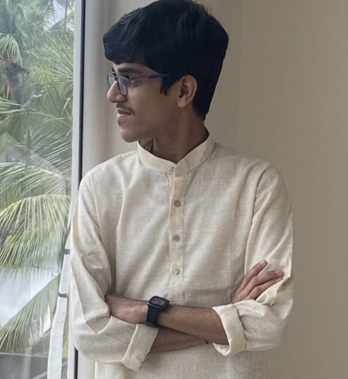

<!DOCTYPE html>
<html>
<head>
    <title>Aryan Srideep | Portfolio</title>
    
</head>
<body>

<header>
    
    <h1>Aryan Srideep</h1>
    
Engineering Student at <a href="https://geckkd.ac.in/" style="color: white; text-decoration: underline;">GEC Kozhikode</a>

     
    <a href="https://www.linkedin.com/in/aryan-srideep-6a6a4a37b" style="background: white; color: #0077b5; padding: 10px 20px; border-radius: 20px;">LinkedIn Profile</a>
</header>

    

        <h2>Education</h2>
        
<strong>Bachelor of Technology</strong> 
        <a href="https://geckkd.ac.in/">Government Engineering College Kozhikode</a>

    

    

        <h2>Professional Memberships</h2>
        
Active member of <a href="https://www.ieee.org/">IEEE</a> and <a href="https://geckkd.ac.in/ieee.php">IEEE SB GECK</a>.

        
        <strong>Technical Societies:</strong>
        

            
<strong>IEEE SIGHT:</strong> <a href="https://sight.ieee.org/">Humanitarian Technology</a>

            
<strong>IEEE IAS:</strong> <a href="https://ias.ieee.org/">Industry Applications</a>

            
<strong>IEEE RAS:</strong> <a href="https://www.ieee-ras.org/">Robotics and Automation</a>

        

    

    

        <h2>Other Affiliations</h2>
        
Member, <a href="https://geckkd.ac.in/iste.php">ISTE GECK Student Chapter</a>

        
Contributor, <a href="https://mulearn.org/">µLearn GECK</a>

    

    

        <h2>Skills</h2>
        
Robotics (RAS)

        
Industrial Apps (IAS)

        
Humanitarian Tech (SIGHT)

        
C/C++

        
HTML/CSS

        
Leadership

    

<footer style="text-align: center; padding: 20px; color: #666;">
    &copy; 2026 Aryan Srideep
</footer>

</body>
</html>
